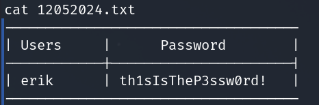

## Introduction
The SaveSanta VM is a intentionally vulnerable VM available on HackMyVM.eu  provided by  released on 29th of February 2024.

The Webserver was taken over by some evil elves and we need to get back into control by boot2root it.

## Setting up the VM on Proxmox
If you want to setup this VM on you Proxmox-Instance see my guide on how to achieve this here: [Setting up VMs in Proxmox]({% post_url 2024-08-20-setting-up-virtual-boxes-on-proxmox })


## Enumeration
Starting with a regular Nmap-scan to get an overview of the machine

```bash
# Nmap scan to enumerate the services of the machine
sudo nmap -sV -A -oN -Pn -p- -T4 savesanta_scan.txt
```

As a result we find 3 open ports and some information about directories "not to visit". 

```bash
# Nmap 7.94SVN scan
 10.10.99.11
Nmap scan report for 10.10.99.11
Host is up, received user-set (0.00071s latency).
Scanned at 2024-08-25 08:53:26 EDT for 25s
Not shown: 65532 closed tcp ports (reset)
PORT      STATE SERVICE REASON         VERSION
22/tcp    open  ssh     syn-ack ttl 63 OpenSSH 9.0p1 Ubuntu 1ubuntu8.6 (Ubuntu Linux; protocol 2.0)
| ssh-hostkey: 
|   256 76:06:46:f1:83:85:a4:22:8c:2b:12:d4:2d:58:27:49 (ECDSA)
| ecdsa-sha2-nistp256 AAAAE2VjZHNhLXNoYTItbmlzdHAyNTYAAAAIbmlzdHAyNTYAAABBBH7MzSovnIRMiRExL2yRZPzvAjSotLWKXBTX
eFdtc99kGXMWcL3tftNdU7jYIDh2k6rlka5SMzxeJlSXKnU2B0E=
|   256 76:54:26:9d:e8:4a:72:5e:6e:7f:68:58:20:6e:bb:d4 (ED25519)
|_ssh-ed25519 AAAAC3NzaC1lZDI1NTE5AAAAIGrfk2HBNp7CTNIjdbS02Vocw337nuKfhxpSIEEmsvRm
80/tcp    open  http    syn-ack ttl 63 Apache httpd
|_http-title: Merry Christmas to everyone - Santa Claus
|_http-server-header: Apache
| http-methods: 
|_  Supported Methods: OPTIONS HEAD GET POST
58065/tcp open  unknown syn-ack ttl 63
No exact OS matches for host (If you know what OS is running on it, see https://nmap.org/submit/ ).
TCP/IP fingerprint:
OS:SCAN(V=7.94SVN%E=4%D=8/25%OT=22%CT=1%CU=34827%PV=Y%DS=2%DC=T%G=Y%TM=66CB
OS:295F%P=x86_64-pc-linux-gnu)SEQ(SP=106%GCD=1%ISR=10D%TI=Z%II=I%TS=A)OPS(O
OS:1=M5B4ST11NW7%O2=M5B4ST11NW7%O3=M5B4NNT11NW7%O4=M5B4ST11NW7%O5=M5B4ST11N
OS:W7%O6=M5B4ST11)WIN(W1=FE88%W2=FE88%W3=FE88%W4=FE88%W5=FE88%W6=FE88)ECN(R
OS:=Y%DF=Y%T=40%W=FAF0%O=M5B4NNSNW7%CC=Y%Q=)T1(R=Y%DF=Y%T=40%S=O%A=S+%F=AS%
OS:RD=0%Q=)T2(R=N)T3(R=N)T4(R=N)T5(R=Y%DF=Y%T=40%W=0%S=Z%A=S+%F=AR%O=%RD=0%
OS:Q=)T6(R=N)T7(R=N)U1(R=Y%DF=N%T=40%IPL=164%UN=0%RIPL=G%RID=G%RIPCK=G%RUCK
OS:=G%RUD=G)IE(R=Y%DFI=N%T=40%CD=S)

Uptime guess: 43.603 days (since Fri Jul 12 18:25:05 2024)
Network Distance: 2 hops
TCP Sequence Prediction: Difficulty=262 (Good luck!)
IP ID Sequence Generation: All zeros
Service Info: OS: Linux; CPE: cpe:/o:linux:linux_kernel

TRACEROUTE (using port 199/tcp)
HOP RTT     ADDRESS
1   0.56 ms OPNsense_sec.cyber.range (10.10.0.1)
2   0.86 ms 10.10.99.11

Read data files from: /usr/bin/../share/nmap
OS and Service detection performed. Please report any incorrect results at https://nmap.org/submit/ .
# Nmap done at Sun Aug 25 08:53:51 2024 -- 1 IP address (1 host up) scanned in 24.90 seconds

```

We can see that the open ports are
- 22 -> ssh
- 80 -> http
- 58065 -> unknown

and on the website the following pages are available:
- /administration/
- /santa

Checking our the obvious first, visiting the machine on port 80 and checking out the found directories

Main page: 



http://10.10.99.11/santa/ provides a username/password login screen

